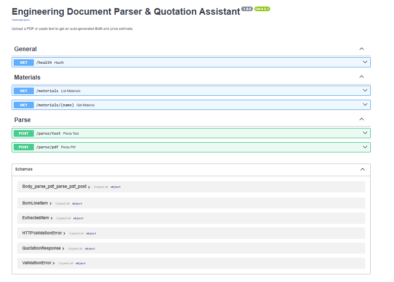
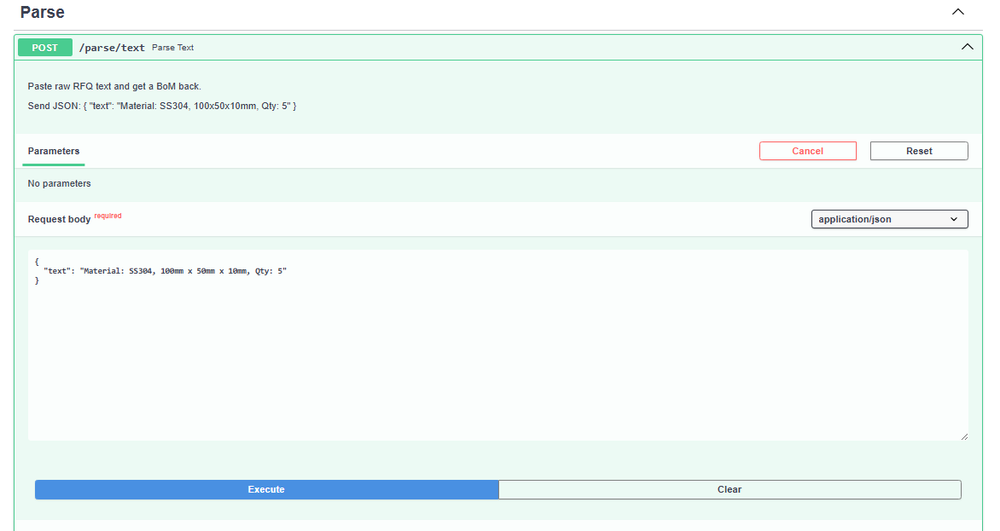
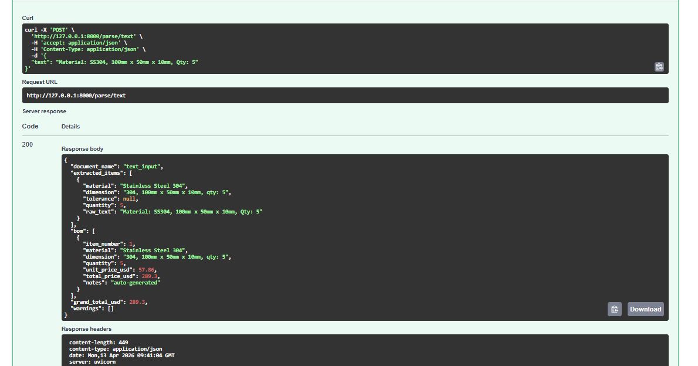
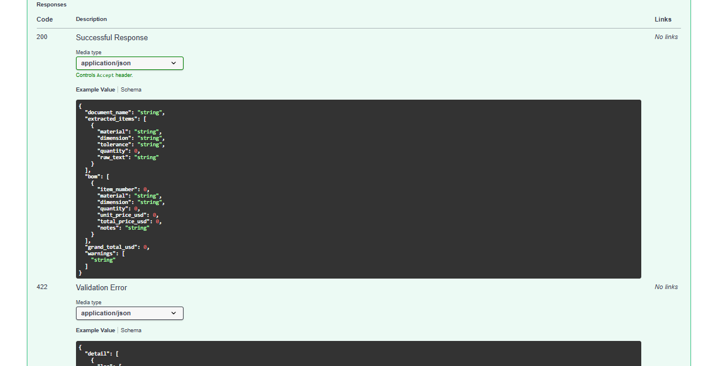
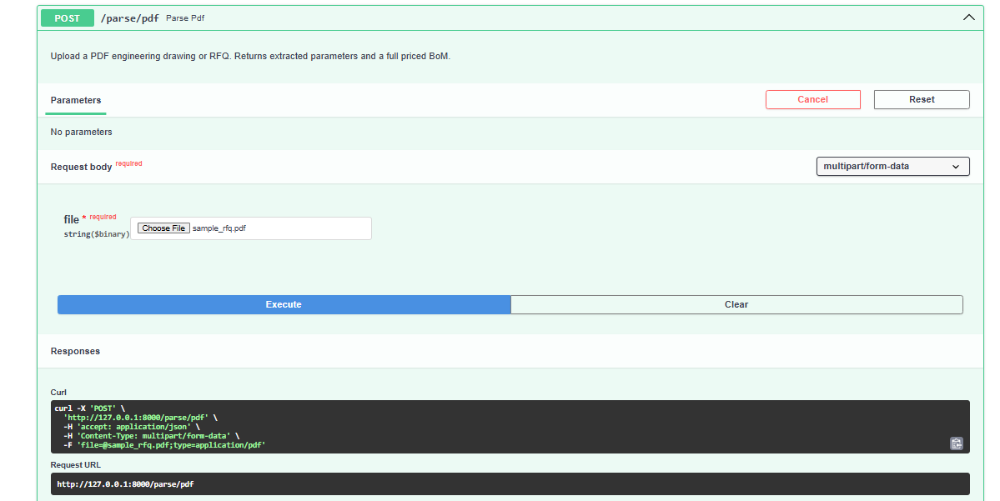
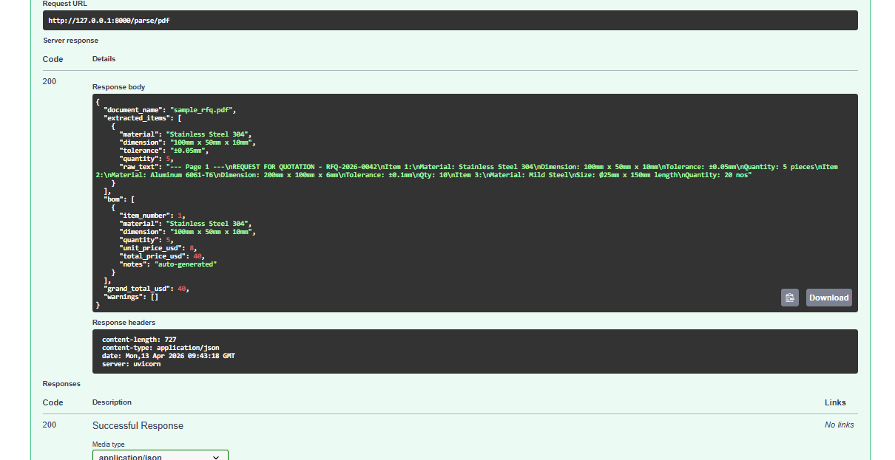
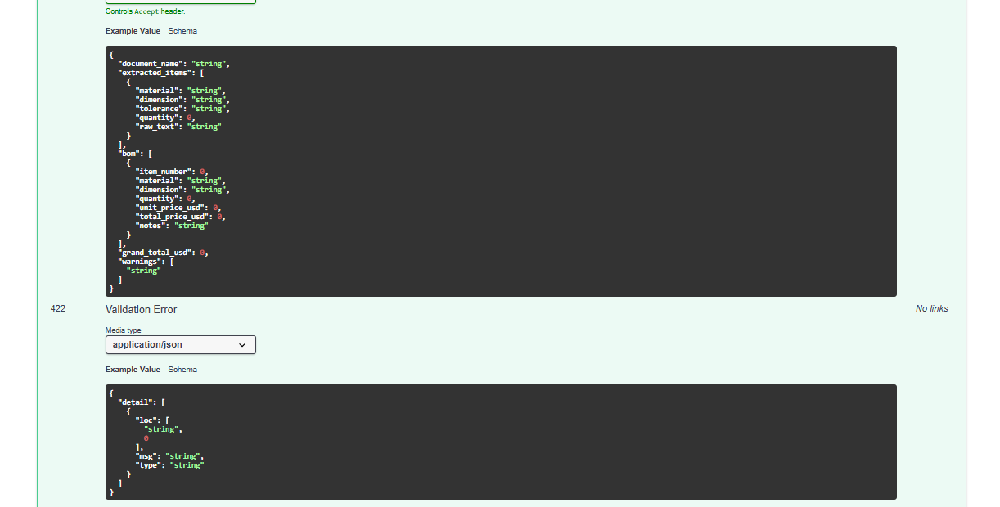

# AI Automated-Engineering RQF Document-Parser-And-Quotation Engine

## 📌 Overview

This project automates the process of reading engineering Requests for Quotation (RFQs) and generating cost estimates.

It extracts key parameters such as material, dimensions, and quantity from text or PDF documents, and produces a structured Bill of Materials (BoM) with pricing.

---

## 🚀 Features

* 📄 Parse engineering text and PDF documents
* 🔍 Extract:

  * Material (e.g. SS304 → Stainless Steel 304)
  * Dimensions (e.g. 100 x 50 x 10 mm)
  * Quantity
  * Tolerances
* 💰 Generate Bill of Materials (BoM)
* ⚙️ Automatic cost estimation using material database
* 🌐 FastAPI backend with interactive Swagger UI

---

## 🧠 How It Works

```
PDF / Text Input
        ↓
Text Extraction (pdfplumber)
        ↓
NLP Parsing (regex-based)
        ↓
Structured Data (material, size, qty)
        ↓
Cost Engine (pricing logic)
        ↓
BoM Output (with total cost)
```

---

## 🛠 Tech Stack

* Python
* FastAPI
* SQLite
* pdfplumber
* Regex-based NLP

---

## ▶️ How to Run

### 1. Clone the repository

```
git clone [https://github.com/cryptic333/Automated-Engineering-Document-Parser-And-Cost-Estimation-Tool]
cd Automated-Engineering-Document-Parser-And-Cost-Estimation-Tool
```

### 2. Install dependencies

```
pip install -r requirements.txt
```

### 3. Run the API server

```
uvicorn main:app --reload
```

### 4. Open in browser

```
http://127.0.0.1:8000/docs
```

---

## 📄 Example Input

```
Material: SS304, 100mm x 50mm x 10mm, Qty: 5
```

---

## 📊 Example Output

* Material: Stainless Steel 304
* Quantity: 5
* Unit Price: $8.00
* Total Cost: $40.00

---

## 🎯 Use Case

This system can be used in:

* Manufacturing workshops
* CNC machining businesses
* Engineering procurement workflows

It helps reduce manual effort in processing RFQs and speeds up quotation generation.

---

## ⚠️ Limitations

* Works only on text-based PDFs (not scanned drawings)
* Uses rule-based (regex) extraction
* Limited material recognition (expandable via database)

---

## 🔮 Future Improvements

* OCR support for scanned PDFs
* AI/LLM-based extraction for unstructured documents
* CAD drawing integration
* Web frontend dashboard

---

## 👨‍💻 Author

Developed as a project for exploring AI-assisted engineering workflows and automation.

---

##  Output









---
